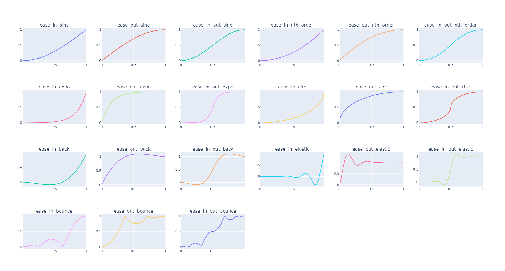

For convenience, I've included a bunch of easing functions because they are very useful in
generative art. Easing functions are mathematical functions that map numbers in the range [0, 1] to numbers in the
range [0, 1], such that `ease(0)` always returns `0` and `ease(1)` always returns `1`. Different easing functions do
different things in the middle, but there are three main flavors:

- An ease-in starts slow and speeds up towards the end.
- An ease-out starts fast and slows down towards the end.
- An ease-in-out starts slow, gets fast in the middle, and then slows down again at the end.

If you want to understand easing functions in more detail, check out [this cheat sheet](https://easings.net).

`elkplot.easing.ease_in_sine`<br>
`elkplot.easing.ease_out_sine`<br>
`elkplot.easing.ease_in_out_sine`<br>
`elkplot.easing.ease_in_nth_order`<br>
`elkplot.easing.ease_out_nth_order`<br>
`elkplot.easing.ease_in_out_nth_order`<br>
`elkplot.easing.ease_in_expo`<br>
`elkplot.easing.ease_out_expo`<br>
`elkplot.easing.ease_in_out_expo`<br>
`elkplot.easing.ease_in_circ`<br>
`elkplot.easing.ease_out_circ`<br>
`elkplot.easing.ease_in_out_circ`<br>
`elkplot.easing.ease_in_back`<br>
`elkplot.easing.ease_out_back`<br>
`elkplot.easing.ease_in_out_back`<br>
`elkplot.easing.ease_in_elastic`<br>
`elkplot.easing.ease_out_elastic`<br>
`elkplot.easing.ease_in_out_elastic`<br>
`elkplot.easing.ease_in_bounce`<br>
`elkplot.easing.ease_out_bounce`<br>
`elkplot.easing.ease_in_out_bounce`<br>

## Usage

All the easing functions accept one argument representing the x-value in [0, 1], and all of them will return the y-value
in [0, 1]. All of them accept any `ArrayLike` argument. If you want to check the value of the easing function at many
different x-coordinates, you can pass in a list of floats or a 1D numpy array.

```python
import numpy as np

import elkplot.easing

eased = elkplot.easing.ease_in_bounce(0.4)
print(eased)  # 0.2275

x = np.linspace(0, 1, 5)
eased = elkplot.easing.ease_in_back(x)
print(eased)  # [ 0.        -0.0640625 -0.0875     0.1828125  1.       ]
```

The following easing functions have optional extra arguments:

::: elkplot.easing