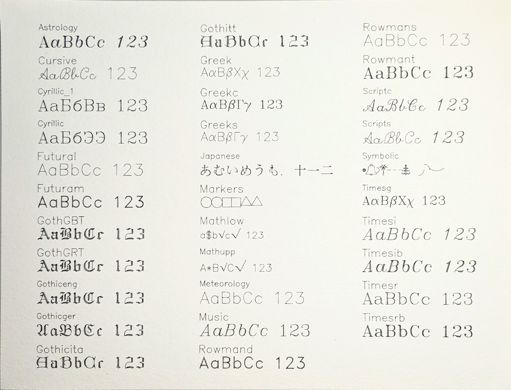
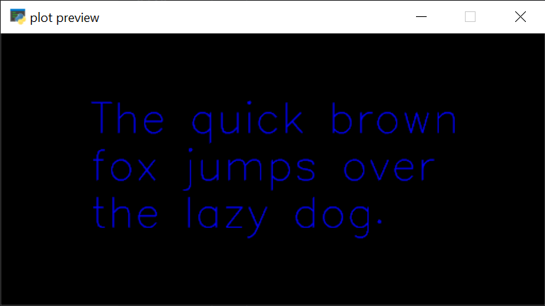

_elkplot_ can render text in a number of different fonts using the built in `text` function. Here are all the
provided fonts plotted on letter paper:



The full list of fonts as you'd use them in code are: `elkplot.ASTROLOGY, elkplot.CURSIVE, elkplot.CYRILLIC_1, elkplot.CYRILLIC, elkplot.FUTURAL, elkplot.FUTURAM, elkplot.GOTHGBT, elkplot.GOTHGRT, elkplot.GOTHICENG, elkplot.GOTHICGER, elkplot.GOTHICITA, elkplot.GOTHITT, elkplot.GREEK, elkplot.GREEKC, elkplot.GREEKS, elkplot.JAPANESE, elkplot.MARKERS, elkplot.MATHLOW, elkplot.MATHUPP, elkplot.METEOROLOGY, elkplot.MUSIC, elkplot.ROWMAND, elkplot.ROWMANS, elkplot.ROWMANT, elkplot.SCRIPTC, elkplot.SCRIPTS, elkplot.SYMBOLIC, elkplot.TIMESG, elkplot.TIMESI, elkplot.TIMESIB, elkplot.TIMESR, elkplot.TIMESRB`.

## Sample Code

```python
import elkplot

size = 4 * elkplot.UNITS.inch, 2 * elkplot.UNITS.inch
font = elkplot.Font(elkplot.METEOROLOGY, 25)
text_drawing = font.wrap("The quick brown fox jumps over the lazy dog.", 3)
text_drawing = elkplot.center(text_drawing, *size)
elkplot.draw(text_drawing, *size, plot=False)
```

The above code results in the following plot (as viewed in the preview window). The paper is 4 inches wide, but the text
has been wrapped to fit in a column 3 inches wide.


Note that all the text generating functions return text that is situated at the origin - use functions
like [`elkplot.center()`][elkplot.shape_utils.center] or [`elkplot.scale_to_fit()`][elkplot.shape_utils.scale_to_fit] to move and scale your text-drawing or
use [`shapely.affinity.translate()`](https://shapely.readthedocs.io/en/stable/manual.html#shapely.affinity.translate) to
reposition the text-drawing to arbitrary positions.

::: elkplot.text.hershey

