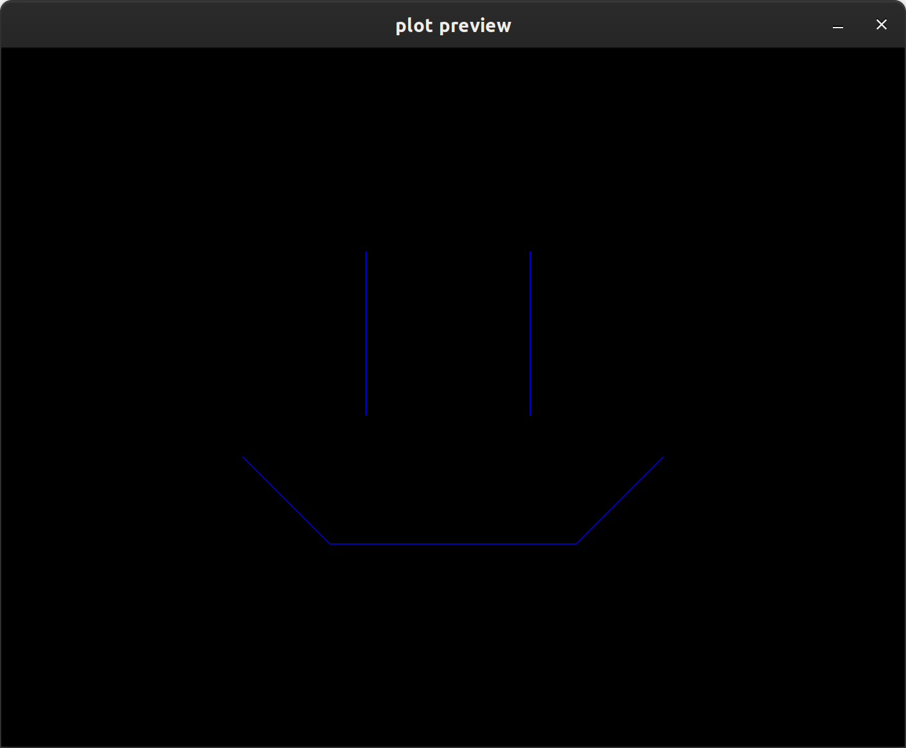

# Turtle Graphics 🐢

## Explanation & Example

ElkPlot includes a recreation of [Logo's](https://en.wikipedia.org/wiki/Logo_(programming_language)) turtle graphics. This is intended as a quick and easy way for learners to start making art without having to go too deep on the Python programming language. (Yet)

Getting started is super easy - just make a turtle and give it some instructions. You can name your turtle whatever you like - I decided to name mine [Gamera](https://en.wikipedia.org/wiki/Gamera). 

```python
import elkplot

w, h = elkplot.sizes.LETTER

# the turtle starts at (0, 0) facing right
gamera = elkplot.Turtle(use_degrees=True)

# draw the left eye
gamera.turn_right(90)
gamera.forward(2)
gamera.raise_pen()

# draw the right eye
gamera.goto(2, 0)
gamera.lower_pen()
gamera.forward(2)
gamera.raise_pen()

# draw the mouth
gamera.goto(-1.5, 2.5)
gamera.lower_pen()
gamera.turn_left(45)
gamera.forward(1.5)
gamera.turn_left(45)
gamera.forward(3)
gamera.turn_left(45)
gamera.forward(1.5)

# render the drawing, center it on a letter size sheet, and draw
d = gamera.drawing() 
d = elkplot.center(d, w, h)
elkplot.draw(d, w, h, plot=True)
```



:::elkplot.turtle
