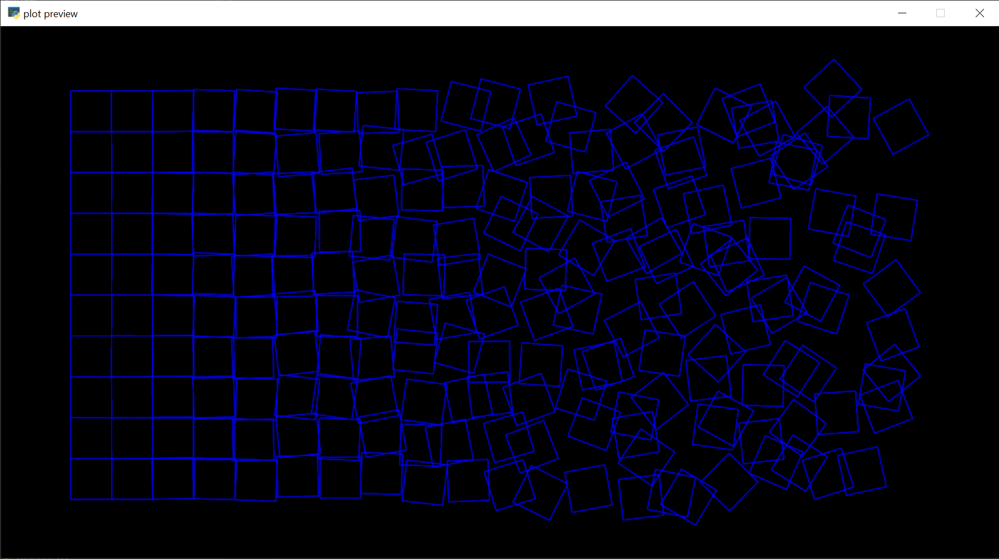
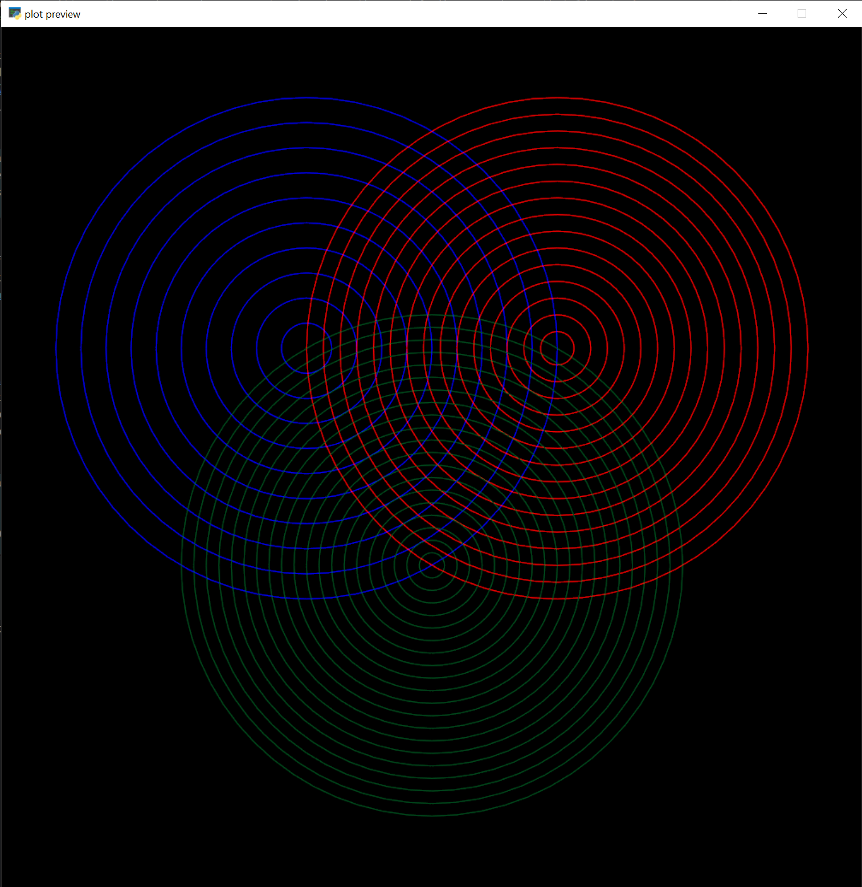

All examples can be found in [the examples module](https://github.com/ejkaplan/elkplot/tree/main/elkplot/examples). For each example, click the link in the header to see the code on github.

## [Schotter](https://github.com/ejkaplan/elkplot/blob/main/elkplot/examples/schotter.py)



This is a famous early instance of generative art by the artist Geog Nees, and the code demonstrates a lot of the techniques that I use all the time when making art.

- In the example as written, the random number generator is given the seed 0. You can change that line to `rng = np.random.defaut_rng()` if you want distinct outputs every time you run the program.

- In works with multiple instances of similar repeated shapes, I'll create a single shape and then in a loop create transformed duplicates using [_shapely_'s affine transformation functions](https://shapely.readthedocs.io/en/stable/manual.html#affine-transformations). For a simple example, below is how I'd create a list of five squares of size 1 next to each other with a gap of 0.2 between them.

    ```python
    import shapely
    from shapely import affinity
    square = shapely.LinearRing([(0, 0), (0, 1), (1, 1), (1, 0)])
    squares = [affinity.translate(square, i * 1.2, 0) for i in range(5)]
    ```

- When I was first composing the image, having the amount of random offset increase linearly across the page made things look too chaotic too fast - I wanted the left side of the page to stay more orderly for longer. So I used a [sine ease-in](api_ref/easing.md) to have the coefficient of chaos rise slowly on the left and faster towards the right.

- Inside the `schotter` function, I collected a bunch of squares in a list that I called `shapes`. At the very end of the function, I used [`shapely.union_all`](https://shapely.readthedocs.io/en/stable/reference/shapely.union_all.html#shapely.union_all) to merge them together into a single `MultiLineString`. Because all the contents of the `shapes` list are 1D lines, I also could alternately have passed the list into the constructor for `MultiLineString`. In the example below, `combined_0` and `combined_1` will look identical when plotted. I like `union_all` better personally, but I have no reason why I like it better. 🤷‍♀️

    ```python
    import shapely
    
    shapes = [...]  # A bunch of shapely.LineString and/or shapely.LinearRing objects
    combined_0 = shapely.MultiLineString(shapes)
    combined_1 = shapely.union_all(shapes)
    ```

- At the very end, I print the metrics before and after optimization
    ```python
        print(elkplot.metrics(drawing))  # 1496 paths, pen down: 486.52 inch, pen up: 237.02 inch
        drawing = elkplot.optimize(drawing, 0.01)
        print(elkplot.metrics(drawing))  # 88 paths, pen down: 486.61 inch, pen up: 82.14 inch
    ```
  This serves no practical purpose, it just demonstrates that the [optimize][elkplot.shape_utils.optimize] function is in fact doing something. You can see that the distance the pen travels while in contact with the page increased slightly, but the pen up distance decreased dramatically, as did the number of distinct paths. When we set the tolerance of `optimize` to 0.01 we were allowing `optimize` to insert extra lines between the ends of paths that are less than a hundredth of an inch apart connecting them and preventing us from having to lift the pen between the two paths, which explains the decrease in the number of paths. The reduction in the pen up distance is mostly due to re-ordering the paths - by drawing paths that are close to each other sequentially we can prevent the pen from criss-crossing all over the page while in the air, dramatically decreasing plot times.

## [Multi-Layer Plotting](https://github.com/ejkaplan/elkplot/blob/main/elkplot/examples/multi_layer.py)



In this example, three images are combined in a [`shapely.GeometryCollection`](https://shapely.readthedocs.io/en/stable/reference/shapely.GeometryCollection.html#shapely.GeometryCollection). The [`draw`][elkplot.util.draw] function interprets these three elements as different layers. When plotted, _elkplot_ will draw the first layer (the blue circles in the preview) and then return to home position and pause, so you can swap out the pen. It will prompt you to press enter when you're ready and then it'll plot the second layer (red in the preview) and then the same process for the third (green in the preview)

Note that because `shapely.GeometryCollection` is still a shapely geometry, a lot of our functions for manipulating shapes can still be used. For example, [`scale_to_fit`][elkplot.shape_utils.scale_to_fit].

```python
circles = shapely.GeometryCollection([left_circles, right_circles, top_circles])
circles = elkplot.scale_to_fit(circles, *size, margin)
```